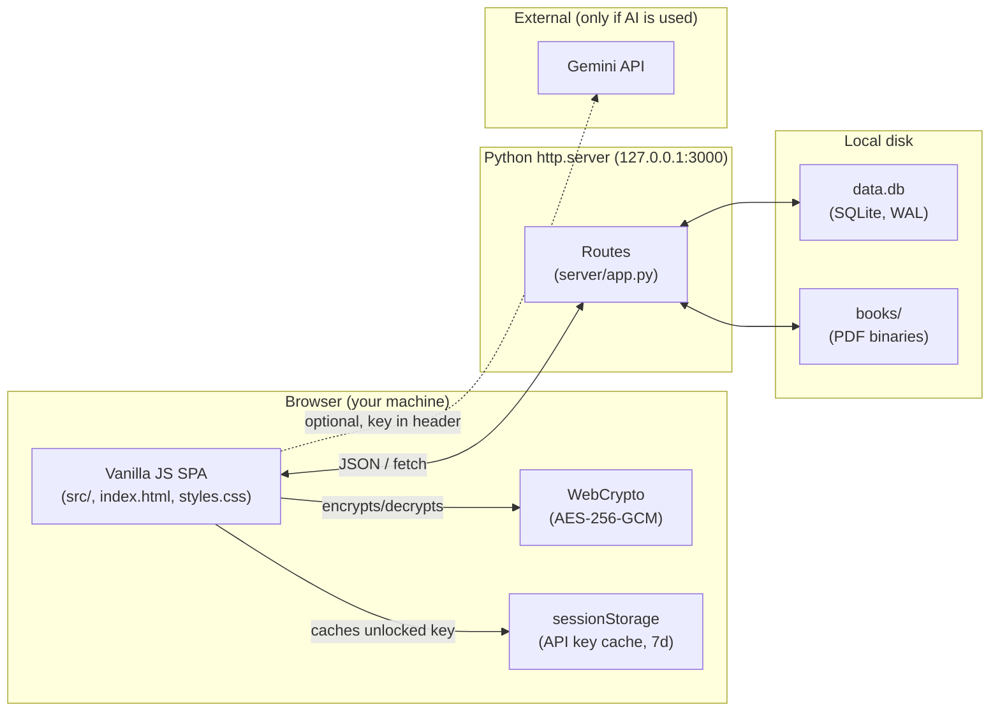

# Habit Maker

[](#)
[](LICENSE)
[](package.json)
[](#storage-and-privacy)
[](#architecture)

A local-first habit tracker and PDF reader in one app. Track daily habits in a monthly grid, manage a personal PDF library with bookmarks and reader mode, and (optionally) generate AI summaries of what you've read — all stored on your own machine, in a single SQLite file.

Built for people who want their data to live on their own disk: no account, no cloud database, no telemetry.

---

## Table of Contents

- [Features](#features)
- [Prerequisites](#prerequisites)
- [Installation and Setup](#installation-and-setup)
- [Environment Variables](#environment-variables)
- [Architecture](#architecture)
- [Schema Reference](#schema-reference)
- [Usage](#usage)
- [Configuration Reference](#configuration-reference)
- [Storage and Privacy](#storage-and-privacy)
- [Contributing](#contributing)
- [Security](#security)
- [License](#license)

---

## Features

**Habit tracking**
- Monthly grid view with one cell per day per habit.
- Categories with custom name, emoji, and color.
- Per-habit monthly goal and streak (current / best).
- Three scheduling modes: every day, specific weekdays, specific month-days.
- Daily notes per habit/day; weekly summary cards; monthly review (wins / blockers / focus).
- Per-habit three-dot menu: move up, move down, edit, delete.

**PDF library**
- Upload PDFs (up to 70 MB each by default) and store them on disk.
- Reader with page navigation, dark mode, and zoom.
- Named bookmarks with notes and a real-page mapping (so "page 42 in the book" is preserved even when the PDF page count differs).
- Bookmark history (every edit is logged).

**Optional AI summaries**
- Bring your own Gemini API key. The key is encrypted at rest with AES-256-GCM derived from a passphrase you choose.
- Per-bookmark summaries; incremental mode that builds on previous summaries.
- Multi-model picker.

**Data ownership**
- One SQLite file (`data.db`) holds everything except PDF binaries (which sit in `books/`).
- One-click JSON export and import.
- Nothing leaves your machine unless you opt into AI summaries.

---

## Prerequisites

| Tool | Minimum version | Why |
|---|---|---|
| Python | 3.10+ | Backend uses `http.server` + `sqlite3` from the standard library. |
| Node.js | 18+ | Only required if you plan to run the linter (`npm run lint`). The app itself does not need Node at runtime. |
| A modern browser | Chrome 110+, Firefox 110+, Edge 110+, or Safari 16.4+ | Uses `crypto.subtle` (WebCrypto), ES2024 modules, and IndexedDB. |
| Disk space | ~100 MB for app + your PDFs | Per-PDF cap is 70 MB. |

No Docker, no build step, no package install required to run the app.

---

## Installation and Setup

### 1. Clone

```bash
git clone https://github.com/semyonsw/habbit_maker.git
cd habbit_maker
```

### 2. Run

**Windows**

```bat
start.bat
```

This launches the Python server on `127.0.0.1:3000` and opens your default browser.

**macOS / Linux**

```bash
python3 server/app.py
```

Then open <http://localhost:3000> in your browser.

### 3. (Optional) Install dev tooling

```bash
npm install
npm run lint
```

Only needed if you intend to contribute code.

### 4. First-run

- The first time you load the app, `data.db` is created in the project root and seeded with the default categories.
- If you plan to use AI summaries, choose **Settings → AI** and set a passphrase before pasting your Gemini API key. The passphrase is required again every 7 days on the same device.

---

## Environment Variables

This project intentionally avoids `.env` files: configuration lives in [src/constants.js](src/constants.js) and the top of [server/app.py](server/app.py). The values below can be overridden via OS environment variables when launching the server.

| Variable | Description | Required | Default |
|---|---|---|---|
| `HABIT_HOST` | Bind host for the HTTP server. | No | `127.0.0.1` |
| `HABIT_PORT` | TCP port for the HTTP server. | No | `3000` |
| `HABIT_DB_PATH` | Absolute path to the SQLite file. | No | `<repo>/data.db` |
| `HABIT_BOOKS_DIR` | Directory where uploaded PDFs are stored. | No | `<repo>/books/` |
| `HABIT_MAX_PDF_BYTES` | Hard upload cap, in bytes. | No | `83886080` (80 MiB) |

> Override only the variables you need: `HABIT_PORT=4000 python3 server/app.py`.

The Gemini API key is **not** an environment variable. It is entered through the UI and stored encrypted in the database; see [Storage and Privacy](#storage-and-privacy).

---

## Architecture

Habit Maker is a thin three-layer app: a static SPA in vanilla JS, a small Python HTTP server, and a single SQLite file plus an on-disk PDF directory.



**Module map (frontend, [src/](src/))**

| Concern | Modules |
|---|---|
| App boot & wiring | [app.js](src/app.js), [events.js](src/events.js) |
| State (in-memory) | [state.js](src/state.js), [constants.js](src/constants.js) |
| Persistence | [persistence.js](src/persistence.js), [db.js](src/db.js), [data-io.js](src/data-io.js), [idb.js](src/idb.js) |
| Domain features | [habits.js](src/habits.js), [books.js](src/books.js), [pdf-reader.js](src/pdf-reader.js), [ai-summary.js](src/ai-summary.js), [model-picker.js](src/model-picker.js) |
| Rendering | [render-dashboard.js](src/render-dashboard.js), [render-analytics.js](src/render-analytics.js), [render-books.js](src/render-books.js), [render-logs.js](src/render-logs.js), [modals.js](src/modals.js), [layout.js](src/layout.js), [loading-ui.js](src/loading-ui.js), [render-registry.js](src/render-registry.js) |
| Cross-cutting | [encryption.js](src/encryption.js), [logging.js](src/logging.js), [preferences.js](src/preferences.js), [utils.js](src/utils.js) |

**Backend ([server/app.py](server/app.py))** — A single `ThreadingHTTPServer` that:
- Serves static files (`index.html`, `styles.css`, `src/*.js`).
- Exposes a small JSON API under `/api/*` for habits, books, bookmarks, summaries, logs, preferences, and secure settings.
- Streams PDF binaries to/from `books/` with a size cap.
- Applies the SQL schema at boot via `executescript([server/migrations.sql](server/migrations.sql))`.

---

## Schema Reference

The full DDL lives in [server/migrations.sql](server/migrations.sql). Key tables:

### `categories`

| Field | Type | Notes |
|---|---|---|
| `id` | TEXT PK | e.g. `cat_health` |
| `name` | TEXT | display name |
| `emoji` | TEXT | single emoji |
| `color` | TEXT | hex string, e.g. `#3E85B5` |

### `habits_daily`

| Field | Type | Notes |
|---|---|---|
| `id` | TEXT PK | e.g. `dh_1` |
| `name` | TEXT | habit name |
| `category_id` | TEXT | nullable; FK → `categories.id` (`ON DELETE SET NULL`) |
| `month_goal` | INTEGER | target completions per month (≥ 1), default 20 |
| `schedule_mode` | TEXT | one of `fixed`, `specific_weekdays`, `specific_month_days` |
| `active_weekdays` | TEXT (JSON) | e.g. `[0,1,2,3,4,5,6]`; used when `schedule_mode = 'specific_weekdays'` |
| `active_month_days` | TEXT (JSON) | e.g. `[1,15,28]`; used when `schedule_mode = 'specific_month_days'` |
| `emoji` | TEXT | optional |
| `order_index` | INTEGER | controls display order in the UI |

### `daily_completions`

| Field | Type | Notes |
|---|---|---|
| `month_key` | TEXT | format `YYYY-MM` |
| `habit_id` | TEXT | FK → `habits_daily.id` (`ON DELETE CASCADE`) |
| `day` | INTEGER | 1–31 |
| `completed` | INTEGER | 0 or 1 |

PK: `(month_key, habit_id, day)`. Indexes: `idx_completions_month`, `idx_completions_habit_month`.

### `daily_notes`

Same shape as `daily_completions` plus `note_text TEXT`. PK on `(month_key, habit_id, day)`. Index: `idx_daily_notes_month`.

### `monthly_review`

`month_key` (PK), `wins`, `blockers`, `focus` — three free-form text fields per month.

### `books`

| Field | Type | Notes |
|---|---|---|
| `book_id` | TEXT PK | |
| `title`, `author` | TEXT | |
| `file_id` | TEXT UNIQUE | name of the file inside `books/` |
| `file_name`, `file_size` | TEXT, INTEGER | |
| `created_at`, `updated_at` | TEXT (ISO 8601) | |

### `bookmarks`

| Field | Type | Notes |
|---|---|---|
| `bookmark_id` | TEXT PK | |
| `book_id` | TEXT | FK → `books.book_id` (`ON DELETE CASCADE`) |
| `label`, `note` | TEXT | |
| `pdf_page` | INTEGER | 1-indexed page in the PDF |
| `real_page` | INTEGER | optional "page printed in the book" |
| `created_at`, `updated_at` | TEXT | |

Index: `idx_bookmarks_book`.

### `bookmark_history`, `summaries`

Per-bookmark audit log and AI-generated content. Both cascade-delete with their parent bookmark. See [server/migrations.sql](server/migrations.sql) for full fields.

### `app_logs`, `prefs`, `secure_settings`

- `app_logs` — client-emitted error/audit log; trimmed to the last ~1000 rows.
- `prefs` — generic key/value JSON blob store for UI preferences.
- `secure_settings` — encrypted Gemini API key (`keyCiphertext`, `saltBase64`, `ivBase64`, `kdfIterations`, `keyUpdatedAt`).

---

## Usage

### Daily flow

1. Open <http://localhost:3000>.
2. The dashboard shows the current month with one row per habit and one column per day. Click a cell to toggle today's completion.
3. Right-click (or use the three-dot menu) on a habit to edit, reorder, or delete it.
4. The sidebar shows monthly progress, streaks, and a donut summary.

### Adding a habit

```text
Sidebar → "+ New Habit" → fill in name, emoji, category, monthly goal,
and schedule mode (fixed / weekdays / month-days) → Save
```

### Importing a PDF

```text
Books → Upload PDF → pick a file (≤ 70 MB) → set title/author → Open
```

Inside the reader, press `B` (or the bookmark button) to add a bookmark at the current page. Bookmarks appear in the sidebar grouped by book.

### Backing up your data

```text
Settings → Export → JSON
```

This produces a single `.json` file containing categories, habits, all month data, and bookmark metadata. PDFs are referenced by `file_id` and not embedded by default — back up the `books/` directory separately.

### Generating an AI summary (optional)

1. **Settings → AI**, paste your Gemini API key, choose a passphrase, save.
2. Open a bookmark, choose a model, set the page range, click **Summarize**.
3. The key is decrypted only for the duration of the request. The decrypted copy is cached in `sessionStorage` for up to 7 days so you don't re-enter the passphrase on every summary.

### API examples

```bash
# Health check (returns 200 + serves the SPA)
curl -i http://localhost:3000/

# Get the full app state blob
curl http://localhost:3000/api/state

# Read encrypted Gemini settings (no plaintext key here)
curl http://localhost:3000/api/secure-settings
```

See [server/app.py](server/app.py) for the full route list.

---

## Configuration Reference

Frontend constants ([src/constants.js](src/constants.js)) you may want to change:

| Constant | Default | Effect |
|---|---|---|
| `MAX_PDF_FILE_SIZE_MB` | `70` | Hard cap on each uploaded PDF. |
| `EMBEDDED_EXPORT_SIZE_WARN_BYTES` | `50 * 1024 * 1024` | Warning threshold when embedding PDFs into a JSON export. |
| `MAX_BOOKMARK_HISTORY` | `200` | Per-bookmark history cap before old events are trimmed. |
| `SUMMARY_MAX_CHARS_PER_CHUNK_DEFAULT` | `12000` | Approx chars per chunk sent to Gemini. |
| `SUMMARY_MAX_PAGES_PER_RUN_DEFAULT` | `120` | Page cap per single summary call. |
| `MAX_LOG_RECORDS` | `1000` | Client log retention. |
| `GEMINI_MODELS` | (list) | Models offered in the model picker. Add or remove freely. |

Backend constants ([server/app.py](server/app.py)):

| Constant | Default | Effect |
|---|---|---|
| `HOST` | `127.0.0.1` | Bind address. **Do not** bind to `0.0.0.0` unless you have added auth. |
| `PORT` | `3000` | TCP port. |
| `MAX_PDF_BYTES` | `80 * 1024 * 1024` | Server-side upload cap (slightly higher than the client cap to allow form overhead). |
| `MIN_KDF_ITERATIONS` | `200_000` | PBKDF2 floor enforced on `PUT /api/secure-settings`. |
| `DB_PATH` | `data.db` | Path to the SQLite file. |
| `BOOKS_DIR` | `books/` | PDF storage directory. |

Each of these can be overridden by an OS env var of the same name prefixed with `HABIT_` (see [Environment Variables](#environment-variables)).

---

## Storage and Privacy

- **Where your data lives.** All habit, bookmark, and summary data is in `data.db` (SQLite). PDF binaries sit in `books/`. Both are in the project directory and never sent anywhere by default.
- **What leaves the machine.** Only AI summaries — and only if you enable them and provide a Gemini API key. The PDF text for the requested page range is sent to Google's Gemini API. Habit data is **never** sent.
- **API key handling.** The Gemini key is encrypted with AES-256-GCM using a key derived from your passphrase via PBKDF2-SHA256 (600,000 iterations by default; existing keys keep their original iteration count and remain decryptable). The plaintext key never touches disk and is sent to Gemini only via the `x-goog-api-key` request header.
- **Passphrase cache.** After you unlock once, the decrypted key sits in your browser's `sessionStorage` for up to 7 days so summaries don't prompt every time. Closing the browser tab does not clear it; only TTL expiry or an explicit lock does.
- **No telemetry.** There is no analytics SDK, no error reporter, no ping. The only outbound network call ever issued is to `generativelanguage.googleapis.com`, and only when you click **Summarize**.

---

## Contributing

Contributions are welcome. See [CONTRIBUTING.md](CONTRIBUTING.md) for the full guide.

**Quick version**

1. Fork the repo and create a feature branch:
   ```bash
   git checkout -b feature/short-description
   # or fix/<bug>, docs/<area>, refactor/<area>
   ```
2. Run the linter:
   ```bash
   npm install
   npm run lint
   ```
3. Manually test the affected area in a browser (`python3 server/app.py`, then exercise the feature). UI changes should be checked on at least one of Chrome and Firefox.
4. Commit with a present-tense, imperative subject (≤ 72 chars). Reference issues with `Closes #123` in the body.
5. Open a PR. The description should answer: **what changed, why, and how to test it.** Screenshots help for any UI change.

**Code style**

- 2-space indent, LF line endings, UTF-8 (enforced by [.editorconfig](.editorconfig)).
- ES modules (`import` / `export`); avoid IIFEs and `var`.
- Prefer pure functions; isolate DOM mutation in the `render-*` modules.
- No new runtime dependencies without discussion — the project's value proposition is "vanilla and inspectable."

**Reporting bugs**

Open an issue with steps to reproduce, expected vs. actual behavior, and (if possible) a JSON export of the smallest state that triggers the bug. Do **not** attach a real `data.db` — it may contain personal data.

**Security disclosures**

Please do not file public issues for security bugs. See [SECURITY.md](SECURITY.md).

---

## Security

For the threat model, supported versions, and disclosure timeline, see [SECURITY.md](SECURITY.md). Summary: report privately, expect an initial response within 7 days.

---

## License

[MIT](LICENSE) © 2026 Semyon

If you build something on top of this, a link back is appreciated but not required.
