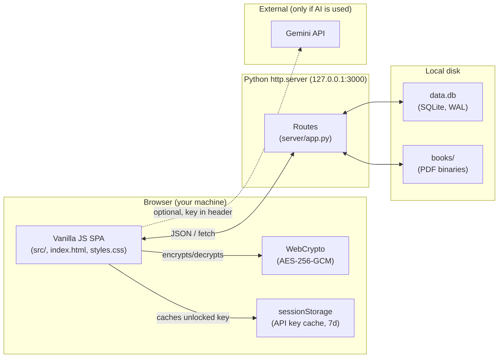

# Habit Maker

[](#)
[](LICENSE)
[](package.json)
[](#storage-and-privacy)
[](#architecture)

A local-first habit tracker and PDF reader in one app. Track daily habits in a monthly grid, manage a personal PDF library with bookmarks and reader mode, and (optionally) generate AI summaries of what you've read — all stored on your own machine, in a single SQLite file.

Built for people who want their data to live on their own disk: no account, no cloud database, no telemetry.

---

## Table of Contents

- [Features](#features)
- [Prerequisites](#prerequisites)
- [Installation and Setup](#installation-and-setup)
- [Environment Variables](#environment-variables)
- [Architecture](#architecture)
- [Schema Reference](#schema-reference)
- [Usage](#usage)
- [Configuration Reference](#configuration-reference)
- [Storage and Privacy](#storage-and-privacy)
- [Contributing](#contributing)
- [Security](#security)
- [License](#license)

---

## Features

**Habit tracking**
- Monthly grid view with one cell per day per habit.
- Categories with custom name, emoji, and color.
- Per-habit monthly goal and streak (current / best).
- Three scheduling modes: every day, specific weekdays, specific month-days.
- Daily notes per habit/day; weekly summary cards; monthly review (wins / blockers / focus).
- Per-habit three-dot menu: move up, move down, edit, delete.

**PDF library**
- Upload PDFs (up to 70 MB each by default) and store them on disk.
- Reader with page navigation, dark mode, and zoom.
- Named bookmarks with notes and a real-page mapping (so "page 42 in the book" is preserved even when the PDF page count differs).
- Bookmark history (every edit is logged).

**Optional AI summaries**
- Bring your own Gemini API key. The key is encrypted at rest with AES-256-GCM derived from a passphrase you choose.
- Per-bookmark summaries; incremental mode that builds on previous summaries.
- Multi-model picker.

**Send feedback, three ways**
- **GitHub Issue** — opens a pre-filled issue in a new tab; nothing is sent automatically.
- **Email instead** — uses your default mail client via `mailto:` (the zero-setup option).
- **Real email via EmailJS** *(optional)* — configure three IDs once and the app POSTs feedback directly to the maintainer's inbox, no mail client required. Credentials are validated by a real test email at save time, so a wrong template ID surfaces immediately instead of failing silently on submit.
- **AI-polished feedback** *(optional)* — if you already have a Gemini key configured, the Email path routes your raw title and description through `gemini-2.5-flash-lite` and shows an **editable** preview of a clean subject + body before sending. Skips automatically when no key is set.

**Activity logs**
- A built-in **Logs** view (sidebar → *Logs*) records every meaningful action — feedback sent, AI summary attempted, encryption unlocked, import/export — with ISO 8601 timestamps, level pills (debug / info / warn / error), and component tags.
- Filter by level, component, or free text. Export as JSON or CSV. Optional live `.log` file via the File System Access API for long-running debugging.

**Data ownership**
- One SQLite file (`data.db`) holds everything except PDF binaries (which sit in `books/`).
- One-click JSON export and import.
- Nothing leaves your machine unless you opt into AI summaries or real-email feedback delivery.

---

## Prerequisites

| Tool | Minimum version | Why |
|---|---|---|
| Python | 3.10+ | Backend uses `http.server` + `sqlite3` from the standard library. |
| Node.js | 18+ | Only required if you plan to run the linter (`npm run lint`). The app itself does not need Node at runtime. |
| A modern browser | Chrome 110+, Firefox 110+, Edge 110+, or Safari 16.4+ | Uses `crypto.subtle` (WebCrypto), ES2024 modules, and IndexedDB. |
| Disk space | ~100 MB for app + your PDFs | Per-PDF cap is 70 MB. |

No Docker, no build step, no package install required to run the app.

---

## Installation and Setup

### 1. Clone

```bash
git clone https://github.com/semyonsw/habbit_maker.git
cd habbit_maker
```

### 2. Run

**Windows**

```bat
start.bat
```

This launches the Python server on `127.0.0.1:3000` and opens your default browser.

**macOS / Linux**

```bash
python3 server/app.py
```

Then open <http://localhost:3000> in your browser.

### 3. (Optional) Install dev tooling

```bash
npm install
npm run lint
```

Only needed if you intend to contribute code.

### 4. First-run

- The first time you load the app, `data.db` is created in the project root and seeded with the default categories.
- If you plan to use AI summaries, choose **Settings → AI** and set a passphrase before pasting your Gemini API key. The passphrase is required again every 7 days on the same device.

---

## Environment Variables

This project intentionally avoids `.env` files: configuration lives in [src/constants.js](src/constants.js) and the top of [server/app.py](server/app.py). The values below can be overridden via OS environment variables when launching the server.

| Variable | Description | Required | Default |
|---|---|---|---|
| `HABIT_HOST` | Bind host for the HTTP server. | No | `127.0.0.1` |
| `HABIT_PORT` | TCP port for the HTTP server. | No | `3000` |
| `HABIT_DB_PATH` | Absolute path to the SQLite file. | No | `<repo>/data.db` |
| `HABIT_BOOKS_DIR` | Directory where uploaded PDFs are stored. | No | `<repo>/books/` |
| `HABIT_MAX_PDF_BYTES` | Hard upload cap, in bytes. | No | `83886080` (80 MiB) |

> Override only the variables you need: `HABIT_PORT=4000 python3 server/app.py`.

The Gemini API key is **not** an environment variable. It is entered through the UI and stored encrypted in the database; see [Storage and Privacy](#storage-and-privacy).

---

## Architecture

Habit Maker is a thin three-layer app: a static SPA in vanilla JS, a small Python HTTP server, and a single SQLite file plus an on-disk PDF directory.



**Module map (frontend, [src/](src/))**

| Concern | Modules |
|---|---|
| App boot & wiring | [app.js](src/app.js), [events.js](src/events.js) |
| State (in-memory) | [state.js](src/state.js), [constants.js](src/constants.js) |
| Persistence | [persistence.js](src/persistence.js), [db.js](src/db.js), [data-io.js](src/data-io.js), [idb.js](src/idb.js) |
| Domain features | [habits.js](src/habits.js), [books.js](src/books.js), [pdf-reader.js](src/pdf-reader.js), [ai-summary.js](src/ai-summary.js), [model-picker.js](src/model-picker.js) |
| Rendering | [render-dashboard.js](src/render-dashboard.js), [render-analytics.js](src/render-analytics.js), [render-books.js](src/render-books.js), [render-logs.js](src/render-logs.js), [modals.js](src/modals.js), [layout.js](src/layout.js), [loading-ui.js](src/loading-ui.js), [render-registry.js](src/render-registry.js) |
| Cross-cutting | [encryption.js](src/encryption.js), [logging.js](src/logging.js), [preferences.js](src/preferences.js), [utils.js](src/utils.js) |

**Backend ([server/app.py](server/app.py))** — A single `ThreadingHTTPServer` that:
- Serves static files (`index.html`, `styles.css`, `src/*.js`).
- Exposes a small JSON API under `/api/*` for habits, books, bookmarks, summaries, logs, preferences, and secure settings.
- Streams PDF binaries to/from `books/` with a size cap.
- Applies the SQL schema at boot via `executescript([server/migrations.sql](server/migrations.sql))`.

---

## Schema Reference

The full DDL lives in [server/migrations.sql](server/migrations.sql). Key tables:

### `categories`

| Field | Type | Notes |
|---|---|---|
| `id` | TEXT PK | e.g. `cat_health` |
| `name` | TEXT | display name |
| `emoji` | TEXT | single emoji |
| `color` | TEXT | hex string, e.g. `#3E85B5` |

### `habits_daily`

| Field | Type | Notes |
|---|---|---|
| `id` | TEXT PK | e.g. `dh_1` |
| `name` | TEXT | habit name |
| `category_id` | TEXT | nullable; FK → `categories.id` (`ON DELETE SET NULL`) |
| `month_goal` | INTEGER | target completions per month (≥ 1), default 20 |
| `schedule_mode` | TEXT | one of `fixed`, `specific_weekdays`, `specific_month_days` |
| `active_weekdays` | TEXT (JSON) | e.g. `[0,1,2,3,4,5,6]`; used when `schedule_mode = 'specific_weekdays'` |
| `active_month_days` | TEXT (JSON) | e.g. `[1,15,28]`; used when `schedule_mode = 'specific_month_days'` |
| `emoji` | TEXT | optional |
| `order_index` | INTEGER | controls display order in the UI |

### `daily_completions`

| Field | Type | Notes |
|---|---|---|
| `month_key` | TEXT | format `YYYY-MM` |
| `habit_id` | TEXT | FK → `habits_daily.id` (`ON DELETE CASCADE`) |
| `day` | INTEGER | 1–31 |
| `completed` | INTEGER | 0 or 1 |

PK: `(month_key, habit_id, day)`. Indexes: `idx_completions_month`, `idx_completions_habit_month`.

### `daily_notes`

Same shape as `daily_completions` plus `note_text TEXT`. PK on `(month_key, habit_id, day)`. Index: `idx_daily_notes_month`.

### `monthly_review`

`month_key` (PK), `wins`, `blockers`, `focus` — three free-form text fields per month.

### `books`

| Field | Type | Notes |
|---|---|---|
| `book_id` | TEXT PK | |
| `title`, `author` | TEXT | |
| `file_id` | TEXT UNIQUE | name of the file inside `books/` |
| `file_name`, `file_size` | TEXT, INTEGER | |
| `created_at`, `updated_at` | TEXT (ISO 8601) | |

### `bookmarks`

| Field | Type | Notes |
|---|---|---|
| `bookmark_id` | TEXT PK | |
| `book_id` | TEXT | FK → `books.book_id` (`ON DELETE CASCADE`) |
| `label`, `note` | TEXT | |
| `pdf_page` | INTEGER | 1-indexed page in the PDF |
| `real_page` | INTEGER | optional "page printed in the book" |
| `created_at`, `updated_at` | TEXT | |

Index: `idx_bookmarks_book`.

### `bookmark_history`, `summaries`

Per-bookmark audit log and AI-generated content. Both cascade-delete with their parent bookmark. See [server/migrations.sql](server/migrations.sql) for full fields.

### `app_logs`, `prefs`, `secure_settings`

- `app_logs` — client-emitted error/audit log; trimmed to the last ~1000 rows.
- `prefs` — generic key/value JSON blob store for UI preferences.
- `secure_settings` — encrypted Gemini API key (`keyCiphertext`, `saltBase64`, `ivBase64`, `kdfIterations`, `keyUpdatedAt`).

---

## Usage

### Daily flow

1. Open <http://localhost:3000>.
2. The dashboard shows the current month with one row per habit and one column per day. Click a cell to toggle today's completion.
3. Right-click (or use the three-dot menu) on a habit to edit, reorder, or delete it.
4. The sidebar shows monthly progress, streaks, and a donut summary.

### Adding a habit

```text
Sidebar → "+ New Habit" → fill in name, emoji, category, monthly goal,
and schedule mode (fixed / weekdays / month-days) → Save
```

### Importing a PDF

```text
Books → Upload PDF → pick a file (≤ 70 MB) → set title/author → Open
```

Inside the reader, press `B` (or the bookmark button) to add a bookmark at the current page. Bookmarks appear in the sidebar grouped by book.

### Backing up your data

```text
Settings → Export → JSON
```

This produces a single `.json` file containing categories, habits, all month data, and bookmark metadata. PDFs are referenced by `file_id` and not embedded by default — back up the `books/` directory separately.

### Generating an AI summary (optional)

1. **Settings → AI**, paste your Gemini API key, choose a passphrase, save.
2. Open a bookmark, choose a model, set the page range, click **Summarize**.
3. The key is decrypted only for the duration of the request. The decrypted copy is cached in `sessionStorage` for up to 7 days so you don't re-enter the passphrase on every summary.

### Sending feedback

Click the **Send feedback** button in the sidebar footer. Fill in **Type** (Bug / Feature / Other), **Title**, and **Description**, then choose how to deliver it:

- **Open GitHub Issue** — opens a pre-filled issue in a new tab; you submit it yourself.
- **Email instead** — uses your default mail client via `mailto:` *unless* you have EmailJS configured (see below), in which case the app posts the feedback as a real email.
- If you have a **Gemini API key** configured, the Email path first polishes your title and description into a clean professional email via `gemini-2.5-flash-lite` and shows an editable preview. You can edit anything before sending.

Every submit, AI polish, and validation attempt is recorded under component **`feedback`** in the **Logs** sidebar view with an ISO timestamp — useful when something looks wrong.

### Setting up real email delivery (EmailJS)

By default the feedback form falls back to `mailto:`, which only works if your browser has a default mail client. To send feedback as a *real* email straight from the browser — no mail client needed — you can wire the app to [EmailJS](https://www.emailjs.com/). The free tier covers 200 emails per month, which is plenty for personal use.

You need three credentials from EmailJS: a **Public Key**, a **Service ID**, and a **Template ID**. Here's how to obtain each:

#### Step 1 — Create a free EmailJS account

1. Go to <https://www.emailjs.com/> and click **Sign up** (top-right).
2. Verify your email and finish onboarding. You land on the EmailJS dashboard at <https://dashboard.emailjs.com/admin>.

#### Step 2 — Add an email service (gets you the **Service ID**)

EmailJS needs to know *which* inbox to send mail through. You typically connect a Gmail / Outlook / Yahoo / custom SMTP account that EmailJS will use as the sender.

1. In the dashboard, open **Email Services** (left sidebar) → **Add New Service**.
2. Pick a provider — for most people **Gmail** is the simplest. Click it.
3. Click **Connect Account** and grant EmailJS permission to send mail on behalf of that Gmail account.
4. Leave the **Service ID** as auto-generated (it will look like `service_z0ur4tn`). Click **Create Service**.
5. Copy the **Service ID** shown in the services list — you'll paste it into the app later.

> The Gmail account you connect here is the *sender*. The recipient (where your feedback lands) is configured in the next step's template.

#### Step 3 — Create an email template (gets you the **Template ID**)

The template defines the subject and body shape of the emails that will be sent. The Habit Maker app fills in three variables: `{{subject}}`, `{{message}}`, and `{{to_email}}`.

1. In the dashboard, open **Email Templates** (left sidebar) → **Create New Template**.
2. In the **Subject** field at the top, type: `{{subject}}`
3. In the **Content** area (the big text box), type the body. The simplest version is just:
   ```
   {{message}}
   ```
   That's it — one line. EmailJS will substitute the polished feedback body in.
4. Open the **Settings** tab of the template (top of the page) and configure:
   - **To Email**: `{{to_email}}` *(this lets the app set the destination dynamically — it will always be the maintainer's address; you don't need to hardcode it here).*
   - **From Name**: anything you like, e.g. `Habit Maker feedback`.
   - **Reply To**: leave blank or use `{{from_email}}` if you want.
5. Click **Save**.
6. Copy the **Template ID** shown at the top of the template page (it will look like `template_htxepod`).

> If you skip step 4's "To Email = `{{to_email}}`" detail, EmailJS will send to whatever fixed address you put there instead. The app sends `to_email` set to the maintainer's address (`semyonsw@gmail.com`); change that constant in [src/constants.js](src/constants.js#L59) if you want feedback delivered elsewhere.

#### Step 4 — Copy the **Public Key**

1. In the dashboard, open **Account** (left sidebar) → **General**.
2. Scroll to the **API Keys** section.
3. Copy the value labelled **Public Key** (it looks like `s7Dk0zX2dZXXUKWQ3`). This is safe to use in the browser — it is *not* a secret. EmailJS limits abuse via the allowed-origins list and rate limiting, not via key secrecy.

#### Step 5 — Paste the three values into Habit Maker

1. Open the app, click **Send feedback** in the sidebar footer.
2. Expand **▾ Email delivery settings (EmailJS) — optional** at the top of the form.
3. Paste your three values:
   - **EmailJS public key** → the value from Step 4.
   - **EmailJS service ID** → the value from Step 2 (starts with `service_`).
   - **EmailJS template ID** → the value from Step 3 (starts with `template_`).
4. Click **Save EmailJS settings**.
5. The app immediately sends a clearly-marked test email to verify the three IDs work together:
   - On success → green ✓ "Saved and validated — a test email was sent." Check the maintainer's inbox; an email with subject **`[Habit Maker] EmailJS credentials test — please ignore`** should arrive within seconds.
   - On failure → red ✗ "Validation failed." Open the **Logs** sidebar, filter component = `feedback`, and look at the most recent `emailjs-validate-fail` row — its context column shows the exact error from EmailJS (e.g. "The template ID not found"), pointing you at the right fix.

That's it. From now on, every "Email instead" submission goes through EmailJS as a real email, and the three IDs persist in your browser's `localStorage` — you won't need to re-enter them. On every modal open, you'll see a passive green "✓ Credentials saved on this browser." confirming they're still in place.

#### Allowed origins (recommended)

For extra safety, lock the public key to your local origin so nobody else can use it:

1. EmailJS dashboard → **Account** → **Security**.
2. Add `http://localhost:3000` (and `http://127.0.0.1:3000` if you use that host) to the **Allow EmailJS API for following hostnames** list.
3. Save.

After this, requests from any origin other than the ones you listed will be rejected by EmailJS, even if someone scrapes your public key.

#### Troubleshooting common errors

| EmailJS error (visible in the Logs view) | What it means | Fix |
|---|---|---|
| `400 The template ID not found` | The Template ID you pasted doesn't exist in your EmailJS account. | Re-copy the ID from the **Email Templates** page; make sure you saved the template after creating it. |
| `400 The service ID not found` | The Service ID you pasted doesn't exist. | Re-copy from the **Email Services** page. |
| `403 The public key is invalid` | Public Key typo or the key was rotated. | Re-copy from **Account → General → API Keys**. |
| `403 ... not allowed for this origin` | The "Allow hostnames" list doesn't include your origin. | Add `http://localhost:3000` (or whatever you use) to **Account → Security**. |
| `400 The Gmail_API service ... is not connected` | The Gmail account you connected in Step 2 was disconnected or its OAuth token expired. | Open **Email Services**, click the affected service, click **Reconnect Account**. |
| `429 Too many requests` | You hit the free-tier rate limit (200 emails / month, or per-minute throttle). | Wait, or upgrade your EmailJS plan. |

### API examples

```bash
# Health check (returns 200 + serves the SPA)
curl -i http://localhost:3000/

# Get the full app state blob
curl http://localhost:3000/api/state

# Read encrypted Gemini settings (no plaintext key here)
curl http://localhost:3000/api/secure-settings
```

See [server/app.py](server/app.py) for the full route list.

---

## Configuration Reference

Frontend constants ([src/constants.js](src/constants.js)) you may want to change:

| Constant | Default | Effect |
|---|---|---|
| `MAX_PDF_FILE_SIZE_MB` | `70` | Hard cap on each uploaded PDF. |
| `EMBEDDED_EXPORT_SIZE_WARN_BYTES` | `50 * 1024 * 1024` | Warning threshold when embedding PDFs into a JSON export. |
| `MAX_BOOKMARK_HISTORY` | `200` | Per-bookmark history cap before old events are trimmed. |
| `SUMMARY_MAX_CHARS_PER_CHUNK_DEFAULT` | `12000` | Approx chars per chunk sent to Gemini. |
| `SUMMARY_MAX_PAGES_PER_RUN_DEFAULT` | `120` | Page cap per single summary call. |
| `MAX_LOG_RECORDS` | `1000` | Client log retention. |
| `GEMINI_MODELS` | (list) | Models offered in the model picker. Add or remove freely. |
| `GEMINI_POLISH_MODEL` | `gemini-2.5-flash-lite` | Model used to polish feedback subject + body. Cheapest Flash variant; change here if you want to use a different one. |
| `FEEDBACK_EMAIL` | `semyonsw@gmail.com` | Destination address used as `to_email` in the EmailJS template and the `mailto:` fallback. If you fork the app, update this. |
| `EMAILJS_API_URL` | `https://api.emailjs.com/api/v1.0/email/send` | EmailJS REST endpoint. Only change if EmailJS publishes a new API version. |

EmailJS credentials are not constants — they are stored per-browser in `localStorage` under three keys (`habitTracker_emailjs_publicKey_v1`, `_serviceId_v1`, `_templateId_v1`) and entered through the **Send feedback** form, not the source code.

Backend constants ([server/app.py](server/app.py)):

| Constant | Default | Effect |
|---|---|---|
| `HOST` | `127.0.0.1` | Bind address. **Do not** bind to `0.0.0.0` unless you have added auth. |
| `PORT` | `3000` | TCP port. |
| `MAX_PDF_BYTES` | `80 * 1024 * 1024` | Server-side upload cap (slightly higher than the client cap to allow form overhead). |
| `MIN_KDF_ITERATIONS` | `200_000` | PBKDF2 floor enforced on `PUT /api/secure-settings`. |
| `DB_PATH` | `data.db` | Path to the SQLite file. |
| `BOOKS_DIR` | `books/` | PDF storage directory. |

Each of these can be overridden by an OS env var of the same name prefixed with `HABIT_` (see [Environment Variables](#environment-variables)).

---

## Storage and Privacy

- **Where your data lives.** All habit, bookmark, and summary data is in `data.db` (SQLite). PDF binaries sit in `books/`. Both are in the project directory and never sent anywhere by default.
- **What leaves the machine.** Three opt-in paths, and only what you ask for:
  1. **AI summaries** — PDF text for the requested page range goes to Google's Gemini API. Habit data is never included.
  2. **AI feedback polish** — your feedback title and description (no other app data) are sent to Gemini's `gemini-2.5-flash-lite` model to produce a polished subject and body. You see the result *before* anything is sent further.
  3. **EmailJS feedback delivery** — if you configured EmailJS, the polished (or raw) subject and body are POSTed to `api.emailjs.com`, which relays the message to the maintainer through the Gmail/SMTP service you connected in your EmailJS dashboard. Habit data, notes, and PDFs are never sent.
- **API key handling.** The Gemini key is encrypted with AES-256-GCM using a key derived from your passphrase via PBKDF2-SHA256 (600,000 iterations by default; existing keys keep their original iteration count and remain decryptable). The plaintext key never touches disk and is sent to Gemini only via the `x-goog-api-key` request header.
- **EmailJS credentials.** The Public Key, Service ID, and Template ID live in your browser's `localStorage` in plaintext — this is by design. EmailJS public keys are *not* secrets (they're rate-limited and origin-locked, not access-controlled), so encryption would add a passphrase prompt for no real security benefit.
- **Passphrase cache.** After you unlock once, the decrypted Gemini key sits in `sessionStorage` for up to 7 days so summaries don't prompt every time. Closing the browser tab does not clear it; only TTL expiry or an explicit lock does.
- **No telemetry.** There is no analytics SDK, no error reporter, no ping. Outbound network calls are limited to `generativelanguage.googleapis.com` (when you summarize or polish feedback) and `api.emailjs.com` (when you send feedback via EmailJS) — and only at the moment you trigger those actions.

---

## Contributing

Contributions are welcome. See [CONTRIBUTING.md](CONTRIBUTING.md) for the full guide.

**Quick version**

1. Fork the repo and create a feature branch:
   ```bash
   git checkout -b feature/short-description
   # or fix/<bug>, docs/<area>, refactor/<area>
   ```
2. Run the linter:
   ```bash
   npm install
   npm run lint
   ```
3. Manually test the affected area in a browser (`python3 server/app.py`, then exercise the feature). UI changes should be checked on at least one of Chrome and Firefox.
4. Commit with a present-tense, imperative subject (≤ 72 chars). Reference issues with `Closes #123` in the body.
5. Open a PR. The description should answer: **what changed, why, and how to test it.** Screenshots help for any UI change.

**Code style**

- 2-space indent, LF line endings, UTF-8 (enforced by [.editorconfig](.editorconfig)).
- ES modules (`import` / `export`); avoid IIFEs and `var`.
- Prefer pure functions; isolate DOM mutation in the `render-*` modules.
- No new runtime dependencies without discussion — the project's value proposition is "vanilla and inspectable."

**Reporting bugs / requesting features**

The fastest way is from inside the app: click the **Send feedback** button in the sidebar footer, fill in the form, and pick a delivery path:

- **Open GitHub Issue** — opens a pre-filled issue in a new tab for you to review and submit.
- **Email instead** — uses your default mail client via `mailto:`, or (if you've set up EmailJS — see [Setting up real email delivery (EmailJS)](#setting-up-real-email-delivery-emailjs)) sends a real email straight from the browser.
- If you have a Gemini API key configured, you'll see an **editable AI-polished preview** of the subject and body before anything is sent.

You stay in control — nothing is sent automatically and your habits, notes, and PDFs are never included.

You can also open an issue directly at the [Issues page](https://github.com/semyonsw/habbit_maker/issues). Include steps to reproduce, expected vs. actual behavior, and (if possible) a JSON export of the smallest state that triggers the bug. Do **not** attach a real `data.db` — it may contain personal data.

**Security disclosures**

Please do not file public issues for security bugs. See [SECURITY.md](SECURITY.md).

---

## Security

For the threat model, supported versions, and disclosure timeline, see [SECURITY.md](SECURITY.md). Summary: report privately, expect an initial response within 7 days.

---

## License

[MIT](LICENSE) © 2026 Semyon

If you build something on top of this, a link back is appreciated but not required.
